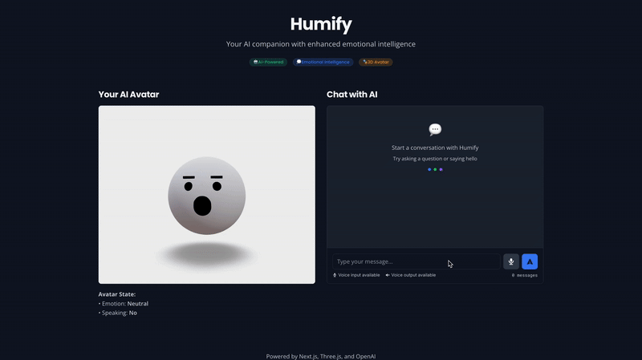

# Humify 🤖✨

[](https://opensource.org/licenses/MIT)
[](https://nodejs.org/)
[](https://nextjs.org/)
[](https://reactjs.org/)
[](https://threejs.org/)

> **Your AI companion with enhanced emotional intelligence and 3D avatar interaction**

Humify is an advanced AI companion platform featuring a realistic 3D avatar with sophisticated emotional intelligence, real-time sentiment analysis, and natural conversation capabilities. Experience human-like interactions with an AI that understands context, emotions, and intent.

## ✨ Features

### 🧠 **Enhanced Emotional Intelligence**
- **Sentiment Analysis**: Real-time positive/negative/neutral sentiment detection
- **Emotion Detection**: 8-core emotion recognition (Joy, Anger, Sadness, Fear, Surprise, Disgust, Trust, Anticipation)
- **Sarcasm Detection**: Intelligent sarcasm identification with confidence scoring
- **Intent Classification**: Context-aware intent recognition (Question, Command, Complaint, Greeting, Gratitude, Apology)
- **Subjectivity Analysis**: Distinguishes between factual statements and opinions

### 🎭 **3D Avatar Experience**
- **Realistic 3D Avatar**: Powered by Three.js with smooth animations
- **Lip Sync**: Synchronized speech-to-avatar mouth movements
- **Emotional Expressions**: Avatar responds with appropriate facial expressions
- **Real-time Rendering**: Smooth 60fps 3D graphics performance

### 🗣️ **Natural Communication**
- **Voice Input**: Real-time speech recognition and processing
- **Text Input**: Traditional chat interface with enhanced analysis
- **Voice Output**: Natural-sounding AI responses
- **Conversation Memory**: Context-aware multi-turn conversations

### 🎨 **Visual Feedback**
- **Emotion Indicators**: Color-coded emotion tags with emojis
- **Confidence Scores**: Visual representation of analysis confidence
- **Real-time Updates**: Live sentiment and emotion tracking
- **Responsive Design**: Beautiful UI that works on all devices

## 🚀 Demo

> **Experience Humify in action** - Watch the avatar respond with emotions and expressions in real-time



*Experience Humify in action - watch the avatar respond with emotions and expressions in real-time*

## 🛠️ Tech Stack

### **Frontend**
- **Next.js 14** - React framework with App Router
- **React 18** - Modern React with hooks and concurrent features
- **Three.js** - 3D graphics and avatar rendering
- **Tailwind CSS** - Utility-first CSS framework
- **Google Fonts** - Typography (Inter, Poppins, Roboto Mono, Open Sans)

### **Backend**
- **Node.js** - JavaScript runtime
- **Express.js** - Web application framework
- **OpenAI API** - GPT-4 for intelligent responses
- **Sentiment.js** - Advanced sentiment analysis
- **Custom Sentiment Enhancer** - Emotion, sarcasm, and intent detection

### **AI & ML**
- **HuggingFace Transformers** - Pre-trained language models
- **Custom Lexicon Analysis** - Emotion and intent classification
- **Pattern Matching** - Sarcasm and subjectivity detection
- **Confidence Scoring** - Analysis reliability metrics

### **Audio Processing**
- **Web Speech API** - Browser-based speech recognition
- **Text-to-Speech** - Natural voice synthesis
- **Lip Sync Engine** - Audio-visual synchronization

## 📦 Installation

### Prerequisites
- Node.js 18+ 
- npm or yarn
- OpenAI API key

### Quick Start

1. **Clone the repository**
   ```bash
   git clone https://github.com/yourusername/humify.git
   cd humify
   ```

2. **Install dependencies**
   ```bash
   # Install root dependencies
   npm install
   
   # Install frontend dependencies
   cd frontend && npm install
   
   # Install backend dependencies
   cd ../backend && npm install
   ```

3. **Environment Setup**
   ```bash
   # Create environment file
   cp backend/.env.example backend/.env
   
   # Add your OpenAI API key
   echo "OPENAI_API_KEY=your_api_key_here" >> backend/.env
   ```

4. **Start the application**
   ```bash
   # From the root directory
   npm run dev
   ```

5. **Access the application**
   - Frontend: http://localhost:3000
   - Backend API: http://localhost:3003

## 🎯 How to Use

### **Starting a Conversation**
1. Open Humify in your browser
2. Choose your preferred input method:
   - **Voice**: Click the microphone and speak naturally
   - **Text**: Type your message in the chat input

### **Understanding Responses**
- **Avatar Reactions**: Watch the 3D avatar respond with expressions
- **Sentiment Analysis**: View real-time emotion and sentiment indicators
- **Enhanced Analysis**: Toggle detailed breakdown of emotions, intent, and sarcasm

### **Example Interaction**
```
User: "Hello, how are you feeling today?"

Humify Response:
- Avatar: Smiles and waves
- Sentiment: Neutral (😐)
- Intent: Greeting (👋)
- Emotion: Joy detected
- Analysis: Friendly greeting with positive undertones
```

## 📁 Project Structure

```
humify/
├── frontend/                 # Next.js frontend application
│   ├── src/
│   │   ├── app/             # Next.js app router
│   │   │   ├── Avatar3D.js
│   │   │   ├── ChatInterface.js
│   │   │   └── EnhancedSentimentDisplay.js
│   │   └── services/        # API services
│   ├── public/              # Static assets
│   └── package.json
├── backend/                  # Node.js backend server
│   ├── index.js             # Main server file
│   ├── sentimentEnhancer.js # Enhanced sentiment analysis
│   ├── test_sentences.json  # Test data
│   └── package.json
├── docs/                     # Documentation
├── README.md                # This file
└── package.json             # Root package.json
```

## 🔧 Configuration

### **Sentiment Analysis Settings**
```javascript
// backend/sentimentEnhancer.js
const config = {
  emotionDetection: true,
  sarcasmDetection: true,
  intentClassification: true,
  subjectivityAnalysis: true,
  visualOutputs: true
};
```

### **Avatar Customization**
```javascript
// frontend/src/components/Avatar3D.js
const avatarConfig = {
  model: 'ready-player-me-url',
  animations: true,
  lipSync: true,
  expressions: true
};
```

## 🧪 Testing

### **Run Test Suite**
```bash
cd backend
npm test
```

### **Test Enhanced Features**
```bash
node testEnhancements.js
```

### **API Testing**
```bash
# Test sentiment analysis
curl -X POST http://localhost:3003/api/chat \
  -H "Content-Type: application/json" \
  -d '{"message": "I love this amazing project!"}'
```

## 🤝 Contributing

We welcome contributions! Please follow these steps:

1. **Fork the repository**
2. **Create a feature branch**
   ```bash
   git checkout -b feature/amazing-feature
   ```
3. **Make your changes**
4. **Add tests** for new functionality
5. **Commit your changes**
   ```bash
   git commit -m 'Add amazing feature'
   ```
6. **Push to the branch**
   ```bash
   git push origin feature/amazing-feature
   ```
7. **Open a Pull Request**

### **Development Guidelines**
- Follow the existing code style
- Add comments for complex logic
- Update documentation for new features
- Ensure all tests pass
- Test on multiple browsers

## 📝 License

This project is licensed under the MIT License - see the [LICENSE](LICENSE) file for details.

```
MIT License

Copyright (c) 2024 Humify

Permission is hereby granted, free of charge, to any person obtaining a copy
of this software and associated documentation files (the "Software"), to deal
in the Software without restriction, including without limitation the rights
to use, copy, modify, merge, publish, distribute, sublicense, and/or sell
copies of the Software, and to permit persons to whom the Software is
furnished to do so, subject to the following conditions:

The above copyright notice and this permission notice shall be included in all
copies or substantial portions of the Software.
```

## 🙏 Acknowledgments

- **OpenAI** for GPT-4 API and advanced language models
- **Three.js** for 3D graphics and avatar rendering
- **Next.js** for the amazing React framework
- **Tailwind CSS** for the beautiful utility-first styling
- **Sentiment.js** for the foundation of sentiment analysis
- **Ready Player Me** for 3D avatar models (optional)
- **Google Fonts** for typography
- **React Three Fiber** for React Three.js integration

## 📞 Support

- **Issues**: [GitHub Issues](https://github.com/yourusername/humify/issues)
- **Discussions**: [GitHub Discussions](https://github.com/yourusername/humify/discussions)
- **Email**: support@humify.ai

## 🌟 Star History

[](https://star-history.com/#yourusername/humify&Date)

---

**Made with ❤️ by the Humify Team**

*Experience the future of AI interaction with Humify - where technology meets emotion.* 